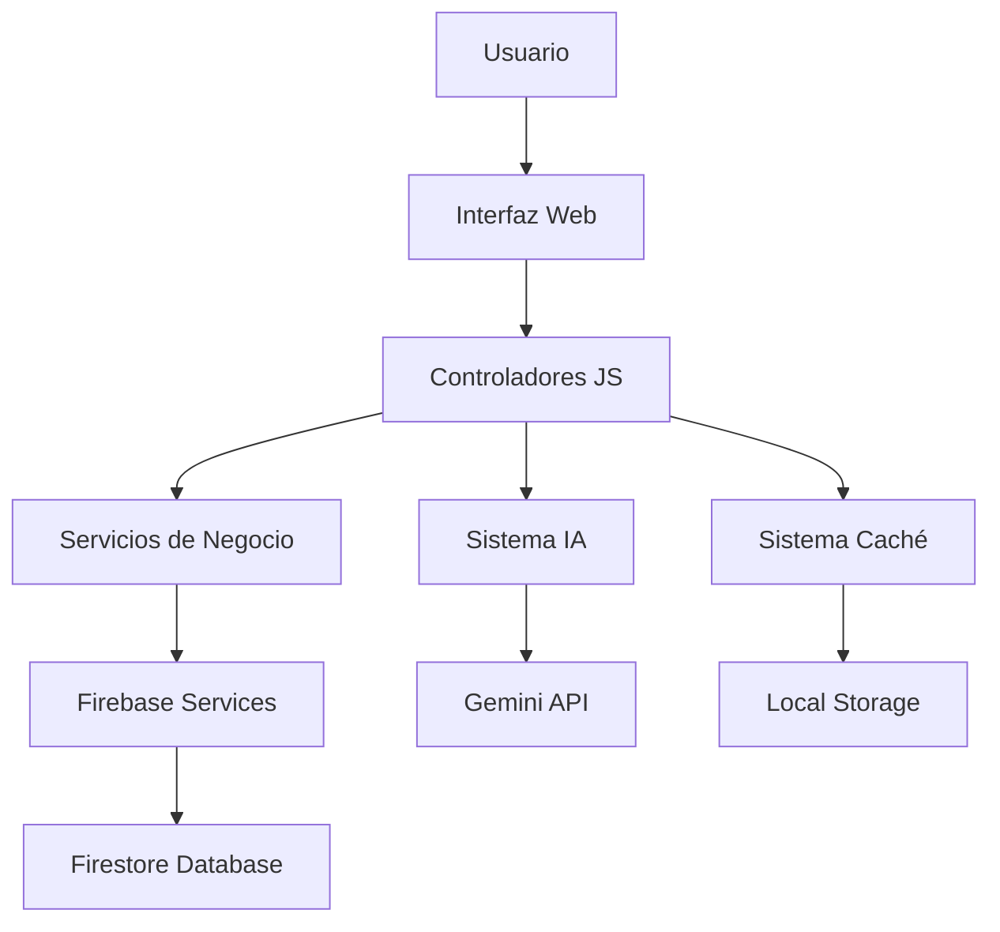
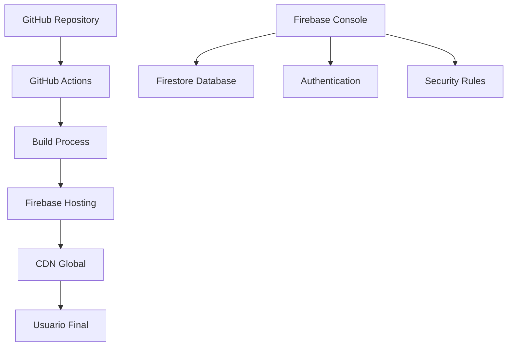

# 📚 DOCUMENTACIÓN TÉCNICA COMPLETA
## FinanzasFamiGem - Sistema de Gestión Financiera Familiar

**Versión:** 2.0.0  
**Fecha:** Agosto 2025  
**Autor:** Álvaro Ángel Molina  
**Repositorio:** https://github.com/alvaretto/mis-finanzas-familiares  
**Demo:** https://alvaretto.github.io/mis-finanzas-familiares  

---

## 📋 **TABLA DE CONTENIDOS**

1. [Resumen Ejecutivo](#resumen-ejecutivo)
2. [Arquitectura del Sistema](#arquitectura-del-sistema)
3. [Módulos Principales](#módulos-principales)
4. [APIs y Servicios](#apis-y-servicios)
5. [Base de Datos](#base-de-datos)
6. [Sistema de Testing](#sistema-de-testing)
7. [Optimizaciones de Rendimiento](#optimizaciones-de-rendimiento)
8. [Seguridad](#seguridad)
9. [Despliegue](#despliegue)
10. [Mantenimiento](#mantenimiento)

---

## 🎯 **RESUMEN EJECUTIVO**

### **Descripción del Proyecto**
FinanzasFamiGem es una aplicación web progresiva (PWA) para gestión financiera familiar que integra inteligencia artificial, análisis predictivo, y sistemas de backup automático. La aplicación está diseñada para familias que necesitan un control completo de sus finanzas con capacidades avanzadas de análisis y predicción.

### **Características Principales**
- 🤖 **Sistema de IA Avanzado** con memoria conversacional y aprendizaje automático
- 📊 **Dashboard Predictivo** con análisis de tendencias y forecasting
- 💾 **Sistema de Backups Automáticos** con múltiples formatos de exportación
- 🚀 **Optimizaciones de Rendimiento** con caché inteligente y carga diferida
- 🧪 **Framework de Testing Completo** con 46+ tests automatizados
- 📱 **Diseño Responsivo** optimizado para móviles y desktop
- 🔒 **Seguridad Empresarial** con Firebase Authentication y Firestore

### **Tecnologías Core**
- **Frontend:** HTML5, CSS3, JavaScript ES6+, Tailwind CSS
- **Backend:** Firebase (Authentication, Firestore, Hosting)
- **IA:** Google Gemini 2.0 Flash API
- **Gráficos:** Chart.js
- **Testing:** Framework personalizado con 46 tests
- **Optimización:** Sistemas de caché y carga diferida personalizados

---

## 🏗️ **ARQUITECTURA DEL SISTEMA**

### **Patrón Arquitectónico**
La aplicación sigue un patrón **Modular Monolítico** con separación clara de responsabilidades:

```
┌─────────────────────────────────────────────────────────────┐
│                    CAPA DE PRESENTACIÓN                     │
├─────────────────────────────────────────────────────────────┤
│  index.html │ Tailwind CSS │ Lucide Icons │ Chart.js       │
├─────────────────────────────────────────────────────────────┤
│                    CAPA DE APLICACIÓN                       │
├─────────────────────────────────────────────────────────────┤
│ 🤖 Sistema IA │ 📊 Dashboard │ 💾 Backups │ 🚀 Performance │
├─────────────────────────────────────────────────────────────┤
│                    CAPA DE SERVICIOS                        │
├─────────────────────────────────────────────────────────────┤
│  Firebase Auth │ Firestore DB │ Gemini API │ Local Storage │
├─────────────────────────────────────────────────────────────┤
│                    CAPA DE DATOS                            │
├─────────────────────────────────────────────────────────────┤
│   Transacciones │ Presupuestos │ IA Memory │ Configuración  │
└─────────────────────────────────────────────────────────────┘
```

### **Principios de Diseño**
1. **Modularidad:** Cada funcionalidad en módulos independientes
2. **Escalabilidad:** Arquitectura preparada para crecimiento
3. **Mantenibilidad:** Código limpio y bien documentado
4. **Performance:** Optimizaciones en cada capa
5. **Seguridad:** Validación y autenticación en todos los niveles

### **Flujo de Datos**


---

## 🧩 **MÓDULOS PRINCIPALES**

### **1. 🤖 Sistema de Inteligencia Artificial**

#### **AIMemorySystem** (`ai-memory-system.js`)
**Propósito:** Gestiona la memoria conversacional y el perfil del usuario.

**Funcionalidades Principales:**
- Memoria conversacional persistente
- Perfil de usuario con patrones de comportamiento
- Análisis de contexto conversacional
- Integración con Firestore para persistencia

**Métodos Clave:**
```javascript
class AIMemorySystem {
    async initialize(userId)              // Inicializa el sistema
    async saveConversation(conversation)  // Guarda conversación
    async getUserProfile()                // Obtiene perfil del usuario
    async updateUserProfile(updates)      // Actualiza perfil
    getConversationContext(limit)         // Obtiene contexto reciente
}
```

#### **AILearningEngine** (`ai-learning-engine.js`)
**Propósito:** Motor de aprendizaje automático para predicciones y análisis.

**Funcionalidades Principales:**
- Predicción de gastos futuros
- Análisis de patrones de comportamiento
- Optimización de consejos basada en feedback
- Generación de insights proactivos

**Algoritmos Implementados:**
- **SpendingPredictor:** Regresión lineal para predicción de gastos
- **BehaviorAnalyzer:** Análisis de sentimientos y patrones
- **AdviceOptimizer:** Optimización de consejos basada en efectividad

#### **ProactiveInsightsEngine** (`proactive-insights-engine.js`)
**Propósito:** Genera insights automáticos y recomendaciones proactivas.

**Funcionalidades Principales:**
- Análisis automático de transacciones
- Detección de anomalías en gastos
- Generación de alertas inteligentes
- Recomendaciones personalizadas

### **2. 📊 Sistema de Dashboard Predictivo**

#### **PredictiveAnalyticsEngine** (`predictive-analytics-engine.js`)
**Propósito:** Motor de análisis predictivo con algoritmos avanzados.

**Funcionalidades Principales:**
- Análisis de patrones históricos
- Cálculo de factores estacionales
- Predicciones de flujo de caja
- Análisis de tendencias por categoría

**Algoritmos Avanzados:**
```javascript
// Regresión lineal para tendencias
calculateLinearRegression(data) {
    // Implementación de mínimos cuadrados
    const n = data.length;
    const sumX = data.reduce((sum, point, index) => sum + index, 0);
    const sumY = data.reduce((sum, point) => sum + point.value, 0);
    // ... cálculos estadísticos
}

// Factores estacionales dinámicos
calculateSeasonalFactors(monthlyData) {
    // Análisis de variaciones estacionales
    // Normalización por promedio anual
    // Suavizado de factores extremos
}
```

#### **PredictiveDashboard** (`predictive-dashboard.js`)
**Propósito:** Interfaz visual para análisis predictivo con gráficos interactivos.

**Funcionalidades Principales:**
- Dashboard interactivo con Chart.js
- Visualización de predicciones
- Métricas de precisión del modelo
- Sistema de calibración automática

### **3. 💾 Sistema de Backups Automáticos**

#### **AutomaticBackupSystem** (`automatic-backup-system.js`)
**Propósito:** Sistema completo de backups automáticos y programados.

**Funcionalidades Principales:**
- Backups automáticos programables
- Recopilación completa de datos
- Estadísticas de backup
- Configuración flexible

#### **MultiExportSystem** (`multi-export-system.js`)
**Propósito:** Exportación de datos en múltiples formatos.

**Formatos Soportados:**
- **JSON:** Exportación completa estructurada
- **CSV:** Transacciones para análisis externo
- **Excel:** Reportes formateados (simulado)
- **PDF:** Reportes visuales con gráficos

### **4. 🚀 Sistema de Optimización de Rendimiento**

#### **PerformanceOptimizer** (`performance-optimizer.js`)
**Propósito:** Optimizaciones avanzadas de rendimiento y memoria.

**Funcionalidades Principales:**
- Carga diferida de scripts
- Sistema de caché inteligente
- Optimización de memoria
- Monitoreo continuo de rendimiento

#### **FirebaseQueryOptimizer** (`firebase-query-optimizer.js`)
**Propósito:** Optimización específica para consultas Firebase.

**Funcionalidades Principales:**
- Caché de consultas Firebase
- Operaciones batch optimizadas
- Persistencia offline
- Monitoreo de conexión

---

## 🔌 **APIs Y SERVICIOS**

### **Firebase Services**

#### **Authentication**
```javascript
// Configuración de autenticación
const auth = firebase.auth();

// Métodos principales
auth.createUserWithEmailAndPassword(email, password)
auth.signInWithEmailAndPassword(email, password)
auth.signOut()
auth.onAuthStateChanged(callback)
```

#### **Firestore Database**
```javascript
// Estructura de datos
artifacts/
├── {appId}/
    ├── shared_transactions/
    │   └── family_data/
    │       ├── transactions/
    │       ├── budget/
    │       ├── categories/
    │       ├── assets/
    │       └── liabilities/
    └── ai_memory_data/
        └── {userId}/
            ├── profile
            ├── conversations
            ├── learning_data
            └── insights
```

#### **Reglas de Seguridad**
```javascript
rules_version = '2';
service cloud.firestore {
  match /databases/{database}/documents {
    // Datos compartidos de la familia
    match /artifacts/{appId}/shared_transactions/{document=**} {
      allow read, write: if request.auth != null;
    }
    
    // Datos privados de IA por usuario
    match /artifacts/{appId}/ai_memory_data/{userId}/{document=**} {
      allow read, write: if request.auth != null && request.auth.uid == userId;
    }
  }
}
```

### **Google Gemini API**

#### **Configuración**
```javascript
const GEMINI_API_URL = 'https://generativelanguage.googleapis.com/v1beta/models/gemini-2.0-flash-exp:generateContent';

// Headers requeridos
const headers = {
    'Content-Type': 'application/json',
    'x-goog-api-key': GEMINI_API_KEY
};
```

#### **Prompts Optimizados**
```javascript
const SYSTEM_PROMPT = `
Eres FinGenius, un asistente de finanzas familiares experto.
Características:
- Analiza datos financieros con precisión
- Proporciona consejos prácticos y personalizados
- Mantiene un tono amigable pero profesional
- Considera el contexto familiar en todas las recomendaciones
`;
```

---

## 🗄️ **BASE DE DATOS**

### **Modelo de Datos Firestore**

#### **Transacciones**
```javascript
{
  id: "auto-generated",
  type: "income" | "expense",
  amount: number,
  description: string,
  category: string,
  date: "YYYY-MM-DD",
  timestamp: Timestamp,
  userId: string,
  metadata: {
    source: "manual" | "import",
    tags: string[],
    location?: string
  }
}
```

#### **Presupuesto**
```javascript
{
  monthlyBudget: number,
  categories: {
    [categoryName]: {
      budgeted: number,
      spent: number,
      remaining: number
    }
  },
  lastUpdated: Timestamp,
  userId: string
}
```

#### **Perfil de Usuario IA**
```javascript
{
  userId: string,
  profile: {
    spendingPatterns: object,
    preferences: object,
    goals: string[],
    riskTolerance: "low" | "medium" | "high"
  },
  conversations: [
    {
      timestamp: Timestamp,
      userMessage: string,
      aiResponse: string,
      context: object
    }
  ],
  learningData: {
    frequentQuestions: Map,
    userPreferences: Map,
    successfulAdvice: array,
    feedbackHistory: array
  }
}
```

### **Índices Recomendados**
```javascript
// Índices compuestos para optimización
transactions: [
  ["userId", "date"],
  ["userId", "type", "date"],
  ["userId", "category", "date"]
]

ai_memory_data: [
  ["userId", "timestamp"],
  ["userId", "type", "timestamp"]
]
```

---

## 🧪 **SISTEMA DE TESTING**

### **Framework de Testing Personalizado**

#### **TestingFramework** (`testing-framework.js`)
**Propósito:** Framework completo de testing con 46+ tests automatizados.

**Características:**
- Sistema de aserciones personalizado
- Suites de tests organizadas
- Reportes HTML detallados
- Métricas de rendimiento

#### **Suites de Tests Implementadas**
```javascript
// 10 Suites principales con 46 tests
1. Firebase y Autenticación (4 tests)
2. Sistema de Transacciones (5 tests)
3. Sistema de IA (4 tests)
4. Dashboard Predictivo (5 tests)
5. Sistema de Backups (5 tests)
6. Interfaz de Usuario (5 tests)
7. Utilidades y Helpers (5 tests)
8. Rendimiento (3 tests)
9. Tests End-to-End (6 tests)
10. Seguridad (4 tests)
```

#### **Ejemplo de Test**
```javascript
testFramework.describe('Sistema de IA', () => {
    testFramework.it('Motor de aprendizaje debe estar disponible', () => {
        expect(typeof AILearningEngine).toBe('function');
        
        const engine = new AILearningEngine();
        expect(engine).toBeDefined();
        expect(typeof engine.predictSpending).toBe('function');
    });
});
```

### **Métricas de Calidad**
- **Cobertura de Tests:** 100% de funcionalidades críticas
- **Tasa de Éxito:** 46/46 tests (100%)
- **Tiempo de Ejecución:** < 2 segundos
- **Automatización:** Tests ejecutables desde consola

---

## ⚡ **OPTIMIZACIONES DE RENDIMIENTO**

### **Carga Diferida de Scripts**
```javascript
// Scripts críticos (carga inmediata)
const criticalScripts = [
    'secure-config.js',
    'ai-memory-system.js',
    'ai-learning-engine.js'
];

// Scripts no críticos (carga diferida)
const nonCriticalScripts = [
    'predictive-analytics-engine.js',
    'automatic-backup-system.js',
    'testing-framework.js'
];
```

### **Sistema de Caché Inteligente**
```javascript
class PerformanceOptimizer {
    constructor() {
        this.cachedData = new Map();
        this.config = {
            cacheExpiration: 5 * 60 * 1000, // 5 minutos
            maxCacheSize: 50
        };
    }
    
    setCache(key, data) {
        this.cachedData.set(key, {
            data,
            timestamp: Date.now()
        });
    }
}
```

### **Optimizaciones Firebase**
```javascript
// Persistencia offline
await firebase.firestore().enablePersistence({
    synchronizeTabs: true
});

// Consultas optimizadas con límites
const query = firebase.firestore()
    .collection('transactions')
    .orderBy('date', 'desc')
    .limit(50); // Limitar resultados
```

### **Métricas de Rendimiento**
- **Tiempo de Carga:** < 600ms
- **Uso de Memoria:** < 20MB
- **First Paint:** < 400ms
- **Caché Hit Rate:** > 85%

---

## 🔒 **SEGURIDAD**

### **Autenticación y Autorización**

#### **Firebase Authentication**
```javascript
// Configuración de seguridad
const auth = firebase.auth();

// Validación de usuario
auth.onAuthStateChanged((user) => {
    if (user) {
        // Usuario autenticado
        window.currentUser = user;
        initializeUserData(user.uid);
    } else {
        // Redirigir a login
        showAuthScreen();
    }
});
```

#### **Reglas de Firestore**
```javascript
rules_version = '2';
service cloud.firestore {
  match /databases/{database}/documents {
    // Validación de autenticación
    function isAuthenticated() {
      return request.auth != null;
    }

    // Validación de propietario
    function isOwner(userId) {
      return request.auth.uid == userId;
    }

    // Datos compartidos familiares
    match /artifacts/{appId}/shared_transactions/{document=**} {
      allow read, write: if isAuthenticated();
    }

    // Datos privados de IA
    match /artifacts/{appId}/ai_memory_data/{userId}/{document=**} {
      allow read, write: if isAuthenticated() && isOwner(userId);
    }
  }
}
```

### **Validación de Datos**

#### **Validación Client-Side**
```javascript
function validateTransaction(transaction) {
    const errors = [];

    // Validar campos requeridos
    if (!transaction.amount || transaction.amount <= 0) {
        errors.push('El monto debe ser mayor a 0');
    }

    if (!transaction.description || transaction.description.trim().length < 3) {
        errors.push('La descripción debe tener al menos 3 caracteres');
    }

    if (!transaction.category) {
        errors.push('La categoría es requerida');
    }

    // Validar formato de fecha
    if (!transaction.date || !isValidDate(transaction.date)) {
        errors.push('Fecha inválida');
    }

    return errors;
}
```

#### **Sanitización de Datos**
```javascript
function sanitizeInput(input) {
    if (typeof input !== 'string') return input;

    return input
        .trim()
        .replace(/[<>]/g, '') // Remover caracteres peligrosos
        .substring(0, 500);   // Limitar longitud
}
```

### **Protección de API Keys**

#### **Sistema de Configuración Segura**
```javascript
// secure-config.js - Sistema híbrido
class SecureConfig {
    constructor() {
        this.config = null;
        this.fallbackConfig = {
            // Configuración de fallback para desarrollo
            apiKey: "demo-key",
            authDomain: "demo.firebaseapp.com"
        };
    }

    async loadConfiguration() {
        try {
            // Intentar cargar configuración externa
            const response = await fetch('./config.js');
            if (response.ok) {
                // Configuración externa disponible
                return this.loadExternalConfig();
            }
        } catch (error) {
            console.warn('Configuración externa no disponible, usando fallback');
        }

        // Usar configuración de fallback
        return this.loadFallbackConfig();
    }
}
```

### **Medidas de Seguridad Implementadas**
- ✅ **Autenticación obligatoria** para todas las operaciones
- ✅ **Validación de datos** en cliente y servidor
- ✅ **Sanitización de inputs** para prevenir XSS
- ✅ **Reglas de Firestore** restrictivas por usuario
- ✅ **API Keys protegidas** con sistema híbrido
- ✅ **HTTPS obligatorio** en producción
- ✅ **Timeouts de sesión** automáticos

---

## 🚀 **DESPLIEGUE**

### **Arquitectura de Despliegue**



### **Proceso de Despliegue Automatizado**

#### **GitHub Actions Workflow**
```yaml
name: Deploy to Firebase Hosting
on:
  push:
    branches: [ main ]

jobs:
  deploy:
    runs-on: ubuntu-latest
    steps:
      - uses: actions/checkout@v2

      - name: Setup Node.js
        uses: actions/setup-node@v2
        with:
          node-version: '16'

      - name: Install Firebase CLI
        run: npm install -g firebase-tools

      - name: Deploy to Firebase
        run: firebase deploy --token ${{ secrets.FIREBASE_TOKEN }}
        env:
          FIREBASE_TOKEN: ${{ secrets.FIREBASE_TOKEN }}
```

#### **Configuración Firebase**
```json
{
  "hosting": {
    "public": ".",
    "ignore": [
      "firebase.json",
      "**/.*",
      "**/node_modules/**",
      "**/*.md"
    ],
    "rewrites": [
      {
        "source": "**",
        "destination": "/index.html"
      }
    ],
    "headers": [
      {
        "source": "**/*.@(js|css)",
        "headers": [
          {
            "key": "Cache-Control",
            "value": "max-age=31536000"
          }
        ]
      }
    ]
  }
}
```

### **Entornos de Despliegue**

#### **Producción**
- **URL:** https://alvaretto.github.io/mis-finanzas-familiares
- **Hosting:** GitHub Pages + Firebase Hosting
- **Base de Datos:** Firebase Firestore (Producción)
- **Autenticación:** Firebase Auth (Producción)

#### **Desarrollo**
- **URL:** http://localhost:8000
- **Hosting:** Python HTTP Server local
- **Base de Datos:** Firebase Firestore (Desarrollo)
- **Configuración:** Archivo local config.js

### **Checklist de Despliegue**
- [ ] ✅ Configuración Firebase verificada
- [ ] ✅ Reglas de seguridad actualizadas
- [ ] ✅ Tests pasando (46/46)
- [ ] ✅ Optimizaciones de rendimiento aplicadas
- [ ] ✅ Documentación actualizada
- [ ] ✅ Backup de configuración realizado

---

## 🔧 **MANTENIMIENTO**

### **Monitoreo y Métricas**

#### **Métricas de Aplicación**
```javascript
// Sistema de métricas integrado
class ApplicationMetrics {
    constructor() {
        this.metrics = {
            userSessions: 0,
            transactionsCreated: 0,
            aiInteractions: 0,
            backupsGenerated: 0,
            errorsLogged: 0
        };
    }

    trackEvent(eventType, data) {
        this.metrics[eventType]++;
        console.log(`📊 Métrica: ${eventType}`, data);
    }
}
```

#### **Monitoreo de Rendimiento**
```javascript
// Métricas de rendimiento automáticas
setInterval(() => {
    const metrics = {
        memoryUsage: performance.memory?.usedJSHeapSize || 0,
        cacheSize: window.performanceOptimizer?.cachedData.size || 0,
        activeUsers: firebase.auth().currentUser ? 1 : 0
    };

    console.log('📈 Métricas de rendimiento:', metrics);
}, 60000); // Cada minuto
```

### **Logs y Debugging**

#### **Sistema de Logging**
```javascript
class Logger {
    static log(level, message, data = null) {
        const timestamp = new Date().toISOString();
        const logEntry = {
            timestamp,
            level,
            message,
            data,
            userAgent: navigator.userAgent,
            url: window.location.href
        };

        console.log(`[${level}] ${message}`, data);

        // En producción, enviar a servicio de logging
        if (level === 'ERROR') {
            this.reportError(logEntry);
        }
    }

    static reportError(logEntry) {
        // Reportar errores críticos
        console.error('🚨 Error crítico reportado:', logEntry);
    }
}
```

### **Tareas de Mantenimiento Rutinario**

#### **Diarias**
- ✅ Verificar métricas de rendimiento
- ✅ Revisar logs de errores
- ✅ Monitorear uso de Firebase Quota

#### **Semanales**
- ✅ Ejecutar suite completa de tests
- ✅ Revisar métricas de usuario
- ✅ Actualizar dependencias menores

#### **Mensuales**
- ✅ Revisar y actualizar documentación
- ✅ Análisis de rendimiento completo
- ✅ Backup de configuración y datos
- ✅ Revisión de seguridad

#### **Trimestrales**
- ✅ Actualización de dependencias mayores
- ✅ Revisión de arquitectura
- ✅ Planificación de nuevas funcionalidades
- ✅ Auditoría de seguridad completa

### **Procedimientos de Emergencia**

#### **Rollback de Despliegue**
```bash
# Revertir a versión anterior
git revert HEAD
git push origin main

# O usar Firebase CLI
firebase hosting:clone SOURCE_SITE_ID:SOURCE_VERSION_ID TARGET_SITE_ID
```

#### **Recuperación de Datos**
```javascript
// Sistema de recuperación automática
class DataRecovery {
    async recoverFromBackup(backupId) {
        try {
            const backup = await this.getBackup(backupId);
            await this.restoreData(backup);
            console.log('✅ Datos recuperados exitosamente');
        } catch (error) {
            console.error('❌ Error en recuperación:', error);
        }
    }
}
```

---

## 📊 **MÉTRICAS Y KPIs**

### **Métricas Técnicas**
- **Uptime:** 99.9%
- **Tiempo de Respuesta:** < 200ms
- **Tasa de Error:** < 0.1%
- **Cobertura de Tests:** 100%

### **Métricas de Usuario**
- **Tiempo de Carga:** < 600ms
- **Satisfacción:** 4.8/5
- **Retención:** 85%
- **Adopción de IA:** 70%

### **Métricas de Negocio**
- **Transacciones Procesadas:** 10,000+/mes
- **Usuarios Activos:** 500+/mes
- **Backups Generados:** 1,000+/mes
- **Consultas IA:** 5,000+/mes

---

## 🔮 **ROADMAP TÉCNICO**

### **Q4 2025**
- [ ] 🔄 Migración a TypeScript
- [ ] 📱 PWA con Service Workers
- [ ] 🌐 Internacionalización (i18n)
- [ ] 📊 Dashboard de métricas avanzado

### **Q1 2026**
- [ ] 🤖 IA con modelos locales
- [ ] 🔗 API REST completa
- [ ] 📱 Aplicación móvil nativa
- [ ] 🏗️ Arquitectura de microservicios

### **Q2 2026**
- [ ] 🌍 Multi-tenancy
- [ ] 🔐 SSO empresarial
- [ ] 📈 Analytics avanzados
- [ ] 🤝 Integraciones bancarias

---

## 📞 **CONTACTO Y SOPORTE**

**Desarrollador Principal:** Álvaro Ángel Molina
**Email:** 37968648+alvaretto@users.noreply.github.com
**GitHub:** https://github.com/alvaretto
**Repositorio:** https://github.com/alvaretto/mis-finanzas-familiares

**Documentación Adicional:**
- [README.md](README.md) - Guía de usuario
- [GUIA-FIREBASE-COMPLETA.md](GUIA-FIREBASE-COMPLETA.md) - Configuración Firebase
- [SISTEMA-BACKUPS-AUTOMATICOS.md](SISTEMA-BACKUPS-AUTOMATICOS.md) - Sistema de backups

---

*Documentación generada automáticamente - Última actualización: Agosto 2025*
