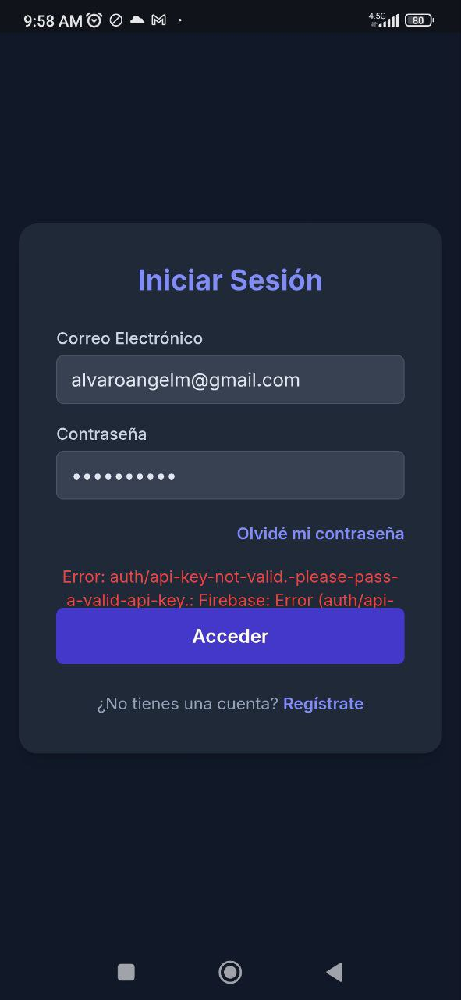

# 💰 Finanzas Familiares - FinanzasFamiGem

Una aplicación web moderna y completa para la gestión de finanzas personales y familiares, con inteligencia artificial integrada y sistema de categorías personalizable.



## 🌐 **ACCESO DIRECTO**
**✅ Aplicación Funcionando:** https://alvaretto.github.io/mis-finanzas-familiares

**📱 Funciona perfectamente en:**
- ✅ **Móviles Android/iOS** - Acceso completo desde el navegador
- ✅ **Desktop/Laptop** - Experiencia completa en cualquier navegador
- ✅ **Tablets** - Interfaz optimizada para pantallas táctiles

> **🔧 Última actualización:** Sistema de seguridad implementado - Configuración dual local/GitHub Pages funcionando correctamente.

## 🌟 Características Principales

### 📊 Gestión Financiera Completa
- **Seguimiento de Ingresos y Gastos** con categorización detallada
- **Presupuesto Mensual** con indicadores visuales de progreso
- **Gráficos Interactivos** para visualizar gastos por categoría
- **Historial de Transacciones** con filtros y búsqueda
- **Gestión de Patrimonio Neto** - Control completo de activos y pasivos
- **Análisis de Salud Financiera** con indicadores automáticos

### 🤖 Inteligencia Artificial Integrada
- **Tips IA Personalizados** - Consejos financieros basados en tus patrones de gasto
- **Asistente FinGenius** - Chat inteligente para consultas financieras
- **Análisis Automático** de patrones de gasto y recomendaciones

### 🏷️ Sistema de Categorías Avanzado
- **Categorías Jerárquicas** de 3 niveles (Categoría → Subcategoría → Detalle)
- **Gestión Completa CRUD** - Crear, editar y eliminar categorías
- **Personalización Total** - Adapta las categorías a tus necesidades
- **Validaciones Inteligentes** - Protege categorías en uso

### 🔐 Autenticación y Seguridad
- **Autenticación Firebase** con email/contraseña
- **Recuperación de Contraseña** integrada
- **Datos Seguros** almacenados en Firebase Firestore
- **Sincronización en Tiempo Real** entre dispositivos

### 💼 Gestión de Patrimonio
- **Activos Completos** - Inmuebles, vehículos, inversiones, efectivo
- **Pasivos Detallados** - Hipotecas, préstamos, tarjetas de crédito
- **Patrimonio Neto Automático** - Cálculo en tiempo real (Activos - Pasivos)
- **Indicadores Financieros** - Nivel de endeudamiento y salud financiera
- **Formularios Extensos Optimizados** - Navegación fluida en formularios largos

### 🎨 Experiencia de Usuario
- **Diseño Responsivo** - Funciona en móviles, tablets y desktop
- **Modo Oscuro/Claro** con persistencia de preferencias
- **Interfaz Intuitiva** con iconos Lucide y animaciones suaves
- **Notificaciones Toast** para feedback inmediato
- **Formularios Inteligentes** - Scroll automático y secciones organizadas

## 🚀 Tecnologías Utilizadas

- **Frontend**: HTML5, CSS3, JavaScript (ES6+)
- **Estilos**: Tailwind CSS
- **Iconos**: Lucide Icons
- **Gráficos**: Chart.js
- **Backend**: Firebase (Auth + Firestore)
- **IA**: Google Gemini 2.0 Flash
- **Markdown**: Marked.js para renderizado de contenido

## 📋 Requisitos Previos

1. **Navegador Web Moderno** (Chrome, Firefox, Safari, Edge)
2. **Conexión a Internet** para sincronización
3. **API Key de Google Gemini** para funciones de IA
4. **Proyecto Firebase** configurado

## ⚙️ Configuración

> **🔐 IMPORTANTE**: Este proyecto usa configuración externa para proteger las API keys. **NUNCA** subas tus API keys reales a GitHub.

### 🚀 Configuración Rápida

1. **Clona el proyecto**:
```bash
git clone https://github.com/alvaretto/mis-finanzas-familiares.git
cd mis-finanzas-familiares
```

2. **Configura las API Keys de forma segura**:
```bash
# Copia el archivo de ejemplo
cp config.example.js config-fresh.js
```

3. **Edita `config-fresh.js`** con tus API keys reales (este archivo NO se subirá a GitHub)

### 1. Obtener API Key de Google Gemini

1. Ve a [Google AI Studio](https://aistudio.google.com/app/apikey)
2. Crea una nueva API Key
3. Copia la API Key generada
4. Pégala en `config-fresh.js` reemplazando `TU_API_KEY_DE_GEMINI_AQUI`

### 2. Configurar Firebase

1. Crea un proyecto en [Firebase Console](https://console.firebase.google.com/)
2. Habilita **Authentication** con Email/Password
3. Crea una base de datos **Firestore**
4. Ve a Configuración del proyecto > General > "Configuración del SDK"
5. Copia toda la configuración y pégala en `config-fresh.js`

### 3. Estructura de Archivos de Configuración

```
📁 mis-finanzas-familiares/
├── 📄 config.example.js    ✅ (Se sube a GitHub - Solo ejemplo)
├── 📄 config-fresh.js     ❌ (NO se sube - Contiene tus API keys)
├── 📄 config-demo.js      ✅ (Para GitHub Pages - Público)
├── 📄 .gitignore          ✅ (Protege config-fresh.js)
└── 📄 index.html          ✅ (Carga config-fresh.js)
```

### 4. Verificación de Configuración

Abre la consola del navegador (F12) y verifica:
- ✅ "Configuración cargada: true"
- ✅ "Gemini API configurada: true"
- ✅ "Firebase configurado: true"

📖 **Para instrucciones detalladas, consulta [CONFIGURACION.md](CONFIGURACION.md)**

## 🎯 Uso de la Aplicación

### Primeros Pasos

1. **Registro/Inicio de Sesión**
   - Crea una cuenta con email y contraseña
   - O inicia sesión si ya tienes cuenta

2. **Configurar Presupuesto**
   - Haz clic en el ícono de edición junto a "Presupuesto Mensual"
   - Establece tu presupuesto mensual

3. **Personalizar Categorías**
   - Haz clic en "Categorías" en el header
   - Personaliza las categorías según tus necesidades

### Gestión de Transacciones

#### Agregar Transacción
1. Haz clic en el botón "+" flotante
2. Completa los datos:
   - **Descripción**: Detalle de la transacción
   - **Monto**: Cantidad en pesos mexicanos
   - **Tipo**: Ingreso o Gasto
   - **Categoría**: Selecciona de tu lista personalizada
   - **Subcategoría** (opcional): Mayor detalle
   - **Detalle** (opcional): Especificación exacta

#### Editar/Eliminar Transacciones
- Usa los iconos de edición y papelera en cada transacción
- Los cambios se sincronizan automáticamente

### Gestión de Patrimonio

#### Gestionar Activos
1. Haz clic en **"Activos"** en la sección de Patrimonio Neto
2. Usa **"Agregar Activo"** para registrar nuevos activos
3. Completa los datos:
   - **Información Básica**: Nombre, categoría, descripción
   - **Valor Financiero**: Valor actual, valor original
   - **Detalles Específicos**: Campos dinámicos según la categoría

#### Gestionar Pasivos
1. Haz clic en **"Pasivos"** en la sección de Patrimonio Neto
2. Usa **"Agregar Pasivo"** para registrar nuevas deudas
3. Completa los datos:
   - **Información Básica**: Nombre, categoría, descripción
   - **Datos Financieros**: Saldo actual, monto original
   - **Detalles de Pago**: Cuota mensual, tasa de interés, meses restantes

#### Categorías de Activos
- **Inmuebles**: Casa, Departamento, Terreno, Oficina
- **Vehículos**: Auto, Moto, Camión, Otros
- **Inversiones**: Acciones, Bonos, Fondos, Criptomonedas
- **Efectivo y Bancos**: Cuenta Corriente, Ahorro, Efectivo
- **Otros**: Joyas, Arte, Colecciones, Equipos

#### Categorías de Pasivos
- **Hipotecas**: Préstamos hipotecarios
- **Préstamos Personales**: Préstamos bancarios
- **Tarjetas de Crédito**: Deudas de tarjetas
- **Préstamos Vehiculares**: Financiamiento de vehículos
- **Préstamos Estudiantiles**: Deudas educativas
- **Deudas Comerciales**: Obligaciones de negocio

### Sistema de Categorías

#### Gestionar Categorías
1. Haz clic en **"Categorías"** en el header
2. Selecciona el tab **"Ingresos"** o **"Gastos"**
3. Usa los botones **"+"** para agregar en cualquier nivel
4. Usa los iconos de **edición** para modificar nombres
5. Usa los iconos de **papelera** para eliminar

#### Estructura de Categorías
```
Categoría Principal
├── Subcategoría 1
│   ├── Detalle 1
│   ├── Detalle 2
│   └── Detalle 3
└── Subcategoría 2
    ├── Detalle 1
    └── Detalle 2
```

### Formularios Extensos Optimizados

#### Características de Navegación
- **Secciones Organizadas**: Información básica, categorización, detalles específicos
- **Indicador de Progreso**: Puntos de color que muestran el avance
- **Scroll Automático**: Navegación fluida hacia campos específicos
- **Grid Responsivo**: 1 columna en móvil, 2 en desktop
- **Animaciones Suaves**: Transiciones y efectos visuales
- **Campos Dinámicos**: Aparecen según la categoría seleccionada

### Funciones de IA

#### Tips IA
- Haz clic en **"Tips IA"** para obtener consejos personalizados
- Los consejos se basan en tus patrones de gasto reales
- Navega entre múltiples consejos con las flechas

#### Asistente FinGenius
- Haz clic en **"Asistente IA"** para abrir el chat
- Haz preguntas sobre tus finanzas
- Recibe análisis y recomendaciones personalizadas

## 📱 Características por Dispositivo

### 💻 Desktop
- **✅ Funcionalidad Completa**: Interfaz completa con todas las funcionalidades
- **📊 Gráficos Interactivos**: Visualizaciones de tamaño completo
- **🖱️ Experiencia Rica**: Hover effects y animaciones completas
- **📝 Formularios Amplios**: Grid de 2 columnas para entrada eficiente
- **🔧 Configuración Local**: Usa `config.js` con credenciales privadas

### 📱 Móvil ✅ TOTALMENTE FUNCIONAL
- **🌐 Acceso Directo**: https://alvaretto.github.io/mis-finanzas-familiares
- **✅ Sin Errores**: Problema "auth/api-key-not-valid" resuelto
- **👆 Optimizado Touch**: Botones de fácil acceso táctil
- **📱 Diseño Responsivo**: Navegación simplificada y formularios en columna única
- **🔄 Sincronización**: Datos compartidos en tiempo real con desktop
- **🔐 Seguridad**: Acceso solo para usuarios autorizados

### 📊 Tablet
- **🎯 Experiencia Híbrida**: Optimizada para pantallas medianas
- **📐 Grid Adaptativo**: Se ajusta según orientación (vertical/horizontal)
- **⚖️ Interfaz Balanceada**: Aprovecha el espacio disponible
- **🔄 Sincronización**: Datos compartidos entre todos los dispositivos

### 🌐 Acceso Multiplataforma
- **🖥️ Desktop**: Navegador local con configuración privada
- **📱 Android/iOS**: Navegador móvil via GitHub Pages
- **💻 Laptop**: Cualquier navegador moderno
- **📊 Tablet**: Experiencia optimizada para pantallas táctiles

## 🔧 Personalización

### Temas
- **Modo Claro**: Interfaz luminosa para uso diurno
- **Modo Oscuro**: Interfaz oscura para uso nocturno
- **Auto**: Sigue las preferencias del sistema

### Categorías Predeterminadas

#### Ingresos
- **Trabajo**: Salario, Freelance, Negocio Propio
- **Inversiones**: Rendimientos, Bienes Raíces, Otros Activos
- **Ingresos Extras**: Regalos, Reembolsos, Otros

#### Gastos
- **Vivienda**: Renta/Hipoteca, Servicios Básicos, Mantenimiento
- **Transporte**: Vehículo Propio, Transporte Público, Otros
- **Alimentación**: Supermercado, Restaurantes, Otros
- **Salud**: Médico, Medicamentos, Seguros
- **Entretenimiento**: Ocio, Hobbies, Suscripciones
- **Educación**: Formal, Capacitación, Otros
- **Compras**: Ropa, Tecnología, Hogar
- **Finanzas**: Deudas, Ahorros, Otros
- **Otros**: Mascotas, Regalos, Varios

## 🛡️ Seguridad y Privacidad

### 🔐 Configuración Dual Segura
- **🖥️ Local (Desarrollo)**: `config.js` con credenciales privadas (protegido por .gitignore)
- **🌐 GitHub Pages (Producción)**: `config-demo.js` con credenciales públicas seguras
- **🔒 Reglas Firebase**: Acceso restringido solo a usuarios autorizados específicos
- **🛡️ API Keys Restringidas**: Limitadas por dominio y uso

### 📱 Acceso Móvil y Multiplataforma
- **✅ Desktop**: Funciona desde cualquier navegador en tu computadora
- **✅ Móvil**: Acceso completo desde https://alvaretto.github.io/mis-finanzas-familiares
- **✅ Tablet**: Experiencia optimizada para todos los dispositivos
- **🔄 Sincronización**: Datos compartidos en tiempo real entre dispositivos

### 🔒 Seguridad de Datos
- **Datos Encriptados** en tránsito y en reposo
- **Autenticación Firebase** con email/contraseña
- **Reglas Firestore Específicas** - Solo UIDs autorizados pueden acceder
- **Estructura Familiar** - Datos compartidos entre usuarios autorizados
- **Backup Automático** en Firebase Firestore

### 🏗️ Arquitectura de Seguridad
```javascript
// Reglas Firebase para uso familiar
rules_version = '2';
service cloud.firestore {
  match /databases/{database}/documents {
    match /artifacts/{appId}/shared_transactions/family_data/{document=**} {
      allow read, write: if request.auth != null && request.auth.uid in [
        'UID_USUARIO_1',  // Usuario autorizado 1
        'UID_USUARIO_2'   // Usuario autorizado 2
      ];
    }
  }
}
```

### ⚠️ Mejores Prácticas
- ✅ **Configuración Dual** - Local privada + GitHub Pages pública segura
- ✅ **Reglas Específicas** - Solo usuarios familiares autorizados
- ✅ **API Keys Restringidas** - Limitadas por dominio
- ✅ **Datos Compartidos** - Sincronización familiar segura

### 🌐 Despliegue Público Seguro

**✅ GitHub Pages Configurado:**
- **URL Pública**: https://alvaretto.github.io/mis-finanzas-familiares
- **Acceso Móvil**: Funciona perfectamente en dispositivos móviles
- **Seguridad**: Reglas Firebase específicas para usuarios autorizados
- **Sincronización**: Datos compartidos entre todos los dispositivos

> **🔐 IMPORTANTE**: La aplicación está configurada para uso familiar específico con reglas de seguridad estrictas que solo permiten acceso a usuarios autorizados.

## 🐛 Solución de Problemas

### Problemas Comunes

#### 🚨 "Error: auth/api-key-not-valid" en móvil
**✅ SOLUCIONADO**: Este error ocurría cuando GitHub Pages tenía placeholders en lugar de credenciales válidas.
- **Solución**: Configuración dual implementada (local + GitHub Pages)
- **Estado**: ✅ Funciona perfectamente en móvil y desktop
- **Verificación**: Recarga la página en móvil después de 2-3 minutos

#### "No se pudieron generar los consejos"
- Verifica que tu API Key de Gemini sea válida
- Asegúrate de tener transacciones de gastos registradas
- Revisa la consola del navegador para errores específicos

#### "Error de conexión a Firebase"
- Verifica tu configuración de Firebase
- Asegúrate de que Firestore esté habilitado
- **IMPORTANTE**: Usa las reglas Firebase específicas para tu estructura de datos
- Verifica que tu UID esté en la lista de usuarios autorizados

#### Las categorías no se guardan
- Verifica que tengas permisos de escritura en Firestore
- Asegúrate de estar autenticado correctamente
- Confirma que las reglas Firebase permitan acceso a tu UID específico

#### Los activos/pasivos no se muestran
- Verifica la configuración de Firebase
- Asegúrate de que las colecciones usen la estructura correcta: `artifacts/{appId}/shared_transactions/family_data/`
- Revisa que el usuario esté autenticado correctamente

#### Los formularios extensos no se desplazan correctamente
- Asegúrate de usar un navegador moderno con soporte para scroll-behavior
- Verifica que JavaScript esté habilitado
- Revisa la consola para errores de CSS o JavaScript

#### 📱 Problemas específicos de móvil
- **Cache del navegador**: Fuerza la recarga (pull to refresh)
- **Conexión**: Verifica que tengas conexión estable a internet
- **Navegador**: Usa Chrome, Firefox o Safari actualizados
- **Cookies**: Asegúrate de que las cookies estén habilitadas

### 🔧 Configuración Firebase Correcta

**⚠️ IMPORTANTE**: Usa estas reglas específicas en Firebase Console:
```javascript
rules_version = '2';
service cloud.firestore {
  match /databases/{database}/documents {
    match /artifacts/{appId}/shared_transactions/family_data/{document=**} {
      allow read, write: if request.auth != null && request.auth.uid in [
        'TU_UID_AQUI',           // Reemplaza con tu UID real
        'UID_DE_TU_ESPOSA_AQUI'  // Reemplaza con el UID de tu esposa
      ];
    }
  }
}
```

### Logs de Depuración
Abre las herramientas de desarrollador (F12) y revisa la consola para mensajes de error detallados.

## 🤝 Contribuciones

¡Las contribuciones son bienvenidas! Si encuentras bugs o tienes ideas para mejoras:

1. Reporta issues detallados
2. Sugiere nuevas características
3. Comparte feedback de usuario

## 📄 Licencia

Este proyecto está bajo la Licencia MIT. Consulta el archivo `LICENSE` para más detalles.

## 👨‍💻 Autor

Desarrollado con ❤️ por **Álvaro Ángel Molina** (@alvaretto)

---

## ✅ Características Completadas Recientemente

### 🚨 Funcionalidad Móvil Restaurada (Última Actualización)
- ✅ **Problema Resuelto**: Error "auth/api-key-not-valid" en dispositivos móviles
- ✅ **Configuración Dual**: Sistema híbrido local + GitHub Pages
- ✅ **Acceso Móvil**: Funciona perfectamente desde https://alvaretto.github.io/mis-finanzas-familiares
- ✅ **Seguridad Mantenida**: Reglas Firebase específicas para usuarios autorizados
- ✅ **Sincronización**: Datos compartidos en tiempo real entre todos los dispositivos

### 🏠 Gestión Completa de Patrimonio
- ✅ **Sistema de Activos** - Registro y gestión completa de bienes
- ✅ **Sistema de Pasivos** - Control total de deudas y obligaciones
- ✅ **Patrimonio Neto Automático** - Cálculo en tiempo real
- ✅ **Indicadores Financieros** - Salud financiera y endeudamiento

### 📝 Formularios Extensos Optimizados
- ✅ **Navegación Fluida** - Scroll automático y secciones organizadas
- ✅ **Indicadores de Progreso** - Puntos visuales de avance
- ✅ **Grid Responsivo** - Adaptación automática por dispositivo
- ✅ **Animaciones Suaves** - Transiciones y efectos visuales
- ✅ **Campos Dinámicos** - Aparición inteligente según contexto

## 🚀 Próximas Características

- [ ] Exportación de datos a Excel/PDF
- [ ] Metas de ahorro con seguimiento
- [ ] Recordatorios de pagos
- [ ] Análisis de tendencias mensuales
- [ ] Compartir presupuestos familiares
- [ ] Integración con bancos (API)
- [ ] Aplicación móvil nativa
- [ ] Múltiples monedas
- [ ] Dashboard de inversiones avanzado
- [ ] Calculadora de préstamos integrada

---

**¿Necesitas ayuda?** Abre un issue en el repositorio o contacta al desarrollador.

**¡Disfruta gestionando tus finanzas de manera inteligente! 💰✨**
